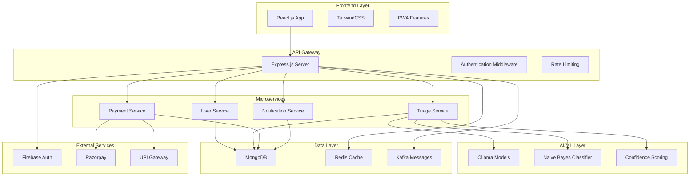
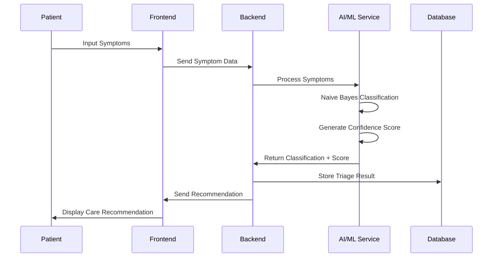

# 🏥 MediConnect: AI Triage System

[](https://reactjs.org/)
[](https://expressjs.com/)
[](https://firebase.google.com/)
[](https://redis.io/)
[](https://kafka.apache.org/)
[](LICENSE)

MediConnect is a smart healthcare solution designed to make patient triaging faster, reliable, and more accessible. It leverages AI-powered symptom analysis with confidence scoring to guide patients toward the right care, while ensuring security, scalability, and efficiency.

The goal is to simplify decision-making in medical workflows and bridge the gap between patients and healthcare providers.

## 📋 Table of Contents

- [🚀 Features](#-features)
- [🛠️ Tech Stack](#️-tech-stack)
- [🏗️ Architecture](#️-architecture)
- [📦 Installation](#-installation)
- [⚙️ Configuration](#️-configuration)
- [🚀 Getting Started](#-getting-started)
- [📊 AI/ML Workflow](#-aiml-workflow)
- [🔐 Security](#-security)
- [🧪 Testing](#-testing)
- [📈 Performance](#-performance)
- [🔮 Future Enhancements](#-future-enhancements)
- [🤝 Contributing](#-contributing)
- [📄 License](#-license)

---

## 🚀 Features

### 🤖 AI-Powered Triage
- **Symptom Analysis**: Advanced Naive Bayes classification for accurate symptom assessment
- **Confidence Scoring**: Real-time confidence metrics to guide medical decisions
- **Smart Recommendations**: Intelligent routing to self-care, teleconsultation, or emergency care

### 🔐 Secure Authentication
- **Firebase Integration**: Robust authentication system for patients and doctors
- **Role-based Access**: Secure access control for different user types
- **Session Management**: Secure session handling and token management

### 💳 Seamless Payments
- **UPI Integration**: Native UPI payment support for Indian healthcare market
- **Razorpay Gateway**: Secure payment processing with multiple payment methods
- **Transaction Security**: End-to-end encrypted payment flows

### ⚡ Scalable Backend
- **Express.js Framework**: High-performance Node.js backend
- **Redis Caching**: Intelligent caching for improved response times
- **Kafka Messaging**: Real-time event handling and microservices communication
- **Microservices Architecture**: Scalable and maintainable service design

### 🎨 Modern UI
- **React.js Frontend**: Fast, responsive, and interactive user interface
- **TailwindCSS Styling**: Modern, clean, and accessible design system
- **Mobile-First Design**: Optimized for all device sizes
- **Progressive Web App**: Offline capabilities and app-like experience

### 🧑‍⚕️ Healthcare Workflow Integration
- **Patient Management**: Comprehensive patient data and history tracking
- **Doctor Dashboard**: Specialized interface for healthcare providers
- **Appointment Scheduling**: Integrated scheduling and calendar management
- **Medical Records**: Secure storage and retrieval of medical information

## 🛠️ Tech Stack

### Frontend
- **React.js** - Modern JavaScript library for building user interfaces
- **TailwindCSS** - Utility-first CSS framework for rapid UI development
- **React Router** - Client-side routing for single-page applications
- **Axios** - HTTP client for API communication
- **React Query** - Data fetching and caching library

### Backend
- **Express.js** - Fast, unopinionated web framework for Node.js
- **Node.js** - JavaScript runtime for server-side development
- **Postman API** - API development and testing platform
- **Redis** - In-memory data structure store for caching
- **Kafka** - Distributed streaming platform for real-time data

### Authentication & Security
- **Firebase Auth** - Comprehensive authentication solution
- **JWT Tokens** - Secure token-based authentication
- **bcrypt** - Password hashing and security
- **Helmet.js** - Security middleware for Express

### Payments
- **UPI** - Unified Payments Interface for Indian market
- **Razorpay** - Payment gateway integration
- **Stripe** - International payment processing

### AI/ML
- **Ollama** - Local AI model deployment and management
- **Naive Bayes** - Multinomial classification algorithm
- **Python ML Pipeline** - Machine learning model training and inference
- **TensorFlow.js** - Client-side machine learning capabilities

### Database & Storage
- **MongoDB** - NoSQL database for flexible data storage
- **Mongoose** - MongoDB object modeling for Node.js
- **Redis** - Caching and session storage
- **AWS S3** - Cloud storage for medical images and documents

## 🏗️ Architecture



## 📦 Installation

### Prerequisites

- **Node.js** (v18.x or higher)
- **npm** (v8.x or higher)
- **MongoDB** (v6.x or higher)
- **Redis** (v7.x or higher)
- **Kafka** (v3.x or higher)
- **Python** (v3.8 or higher) - for AI/ML components

### Clone the Repository

```bash
# Clone the repository
git clone https://github.com/your-username/mediconnect.git

# Navigate to the project directory
cd mediconnect
```

### Install Dependencies

```bash
# Install backend dependencies
cd backend
npm install

# Install frontend dependencies
cd ../frontend
npm install

# Install AI/ML dependencies
cd ../ai-ml
pip install -r requirements.txt
```

## ⚙️ Configuration

### Environment Variables

Create `.env` files in respective folders with the following configurations:

#### Backend (.env)
```env
# Server Configuration
PORT=3000
NODE_ENV=development

# Database
MONGODB_URI=mongodb://localhost:27017/mediconnect
REDIS_URL=redis://localhost:6379

# Kafka Configuration
KAFKA_BROKER=localhost:9092
KAFKA_TOPIC_PREFIX=mediconnect

# Firebase Configuration
FIREBASE_PROJECT_ID=your-project-id
FIREBASE_PRIVATE_KEY=your-private-key
FIREBASE_CLIENT_EMAIL=your-client-email

# Razorpay Configuration
RAZORPAY_KEY_ID=your-razorpay-key-id
RAZORPAY_KEY_SECRET=your-razorpay-key-secret

# JWT Configuration
JWT_SECRET=your-jwt-secret
JWT_EXPIRES_IN=24h

# AI/ML Configuration
OLLAMA_BASE_URL=http://localhost:11434
MODEL_NAME=llama2
```

#### Frontend (.env)
```env
# API Configuration
REACT_APP_API_URL=http://localhost:3000
REACT_APP_FIREBASE_API_KEY=your-firebase-api-key
REACT_APP_FIREBASE_AUTH_DOMAIN=your-project.firebaseapp.com
REACT_APP_FIREBASE_PROJECT_ID=your-project-id

# Payment Configuration
REACT_APP_RAZORPAY_KEY_ID=your-razorpay-key-id
```

### Firebase Setup

1. Create a Firebase project at [Firebase Console](https://console.firebase.google.com/)
2. Enable Authentication with Email/Password
3. Download the Firebase configuration
4. Add the configuration to your `.env` files

### Razorpay Setup

1. Create a Razorpay account at [Razorpay Dashboard](https://dashboard.razorpay.com/)
2. Generate API keys from the dashboard
3. Add the keys to your environment variables

## 🚀 Getting Started

### 1. Start the Backend Services

```bash
# Start MongoDB
mongod

# Start Redis
redis-server

# Start Kafka (if using)
kafka-server-start.sh config/server.properties

# Start the backend server
cd backend
npm run dev
```

### 2. Start the AI/ML Service

```bash
# Start Ollama
ollama serve

# Pull the required model
ollama pull llama2

# Start the AI/ML service
cd ai-ml
python app.py
```

### 3. Start the Frontend

```bash
# Start the React development server
cd frontend
npm start
```

### 4. Access the Application

- **Frontend**: http://localhost:3000
- **Backend API**: http://localhost:5000
- **AI/ML Service**: http://localhost:8000

## 📊 AI/ML Workflow

### Triage Process Flow



### AI Model Architecture

1. **Symptom Preprocessing**
   - Text normalization and cleaning
   - Feature extraction from symptoms
   - Medical terminology standardization

2. **Naive Bayes Classification**
   - Multinomial Naive Bayes for symptom classification
   - Probability calculation for each condition
   - Confidence scoring based on feature importance

3. **Recommendation Engine**
   - Risk assessment based on confidence scores
   - Care pathway recommendations
   - Emergency escalation triggers

### Model Training

```bash
# Train the Naive Bayes model
cd ai-ml
python train_model.py

# Evaluate model performance
python evaluate_model.py

# Deploy model to Ollama
python deploy_model.py
```

## 🔐 Security

### Authentication & Authorization

- **Firebase Authentication**: Secure user authentication
- **JWT Tokens**: Stateless authentication
- **Role-based Access Control**: Different permissions for patients and doctors
- **Session Management**: Secure session handling

### Data Protection

- **Encryption at Rest**: All sensitive data encrypted in database
- **Encryption in Transit**: HTTPS/TLS for all communications
- **HIPAA Compliance**: Healthcare data protection standards
- **Data Anonymization**: Patient data anonymization for AI training

### API Security

- **Rate Limiting**: Prevent API abuse
- **Input Validation**: Comprehensive input sanitization
- **CORS Configuration**: Proper cross-origin resource sharing
- **Security Headers**: Helmet.js for security headers


## 📈 Performance

### Caching Strategy

- **Redis Caching**: Frequently accessed data caching
- **CDN Integration**: Static asset delivery optimization
- **Database Indexing**: Optimized database queries
- **API Response Caching**: Reduced API response times

### Monitoring

- **Application Performance Monitoring**: Real-time performance tracking
- **Error Tracking**: Comprehensive error logging and monitoring
- **Health Checks**: Service health monitoring
- **Metrics Dashboard**: Performance metrics visualization

## 🔮 Future Enhancements

### 📈 Advanced AI/ML Features
- **Deep Learning Models**: Advanced neural networks for higher triage accuracy
- **Computer Vision**: Medical image analysis capabilities
- **Natural Language Processing**: Advanced symptom understanding
- **Predictive Analytics**: Proactive health risk assessment

### 🌍 Global Expansion
- **Multilingual Support**: Support for multiple languages and regions
- **Local Payment Methods**: Integration with regional payment systems
- **Cultural Adaptation**: Healthcare practices adaptation for different regions
- **Regulatory Compliance**: Compliance with international healthcare regulations

### 🏥 Healthcare System Integration
- **EHR Integration**: Electronic Health Records system integration
- **Hospital Management**: Complete hospital workflow integration
- **Insurance Integration**: Health insurance claim processing
- **Pharmacy Integration**: Prescription and medication management

### 🔬 Advanced Analytics
- **Population Health Analytics**: Community health insights
- **Clinical Decision Support**: Advanced clinical decision-making tools
- **Research Integration**: Clinical research data collection
- **Outcome Prediction**: Patient outcome prediction models

## 🤝 Contributing

We welcome contributions to improve MediConnect! Here's how you can help:

### Ways to Contribute

- 🐛 **Report Bugs**: Found a bug? Open an issue with detailed information
- 💡 **Suggest Features**: Have an idea? Create a feature request
- 📝 **Improve Documentation**: Help make the docs clearer and more comprehensive
- 🔧 **Fix Issues**: Submit pull requests for bug fixes
- 🎓 **Add AI Models**: Contribute new machine learning models
- 🏥 **Healthcare Expertise**: Share medical domain knowledge

### Contribution Guidelines

1. **Fork the repository**
2. **Create a feature branch**: `git checkout -b feature/amazing-feature`
3. **Commit your changes**: `git commit -m 'Add amazing feature'`
4. **Push to the branch**: `git push origin feature/amazing-feature`
5. **Open a Pull Request**

### Code Standards

- Follow existing code style and conventions
- Write clear, descriptive commit messages
- Include tests for new features
- Update documentation as needed
- Ensure all tests pass
- Follow healthcare data security guidelines

### Usages Guidelines:

- ✅ **Commercial use** - Use this project in commercial applications
- ✅ **Modification** - Modify the code to suit your needs
- ✅ **Distribution** - Share and distribute the code
- ✅ **Private use** - Use the code in private projects
- ❌ **Liability** - No warranty or liability protection
- ❌ **Warranty** - No warranty provided

---

## 🎯 Ready to Transform Healthcare?

### 🚀 Quick Start (30 minutes)
Set up the basic application and test the triage system with sample symptoms.

### 🏥 Full Deployment (2-3 hours)
Complete setup with all services, AI models, and payment integration.

### 🔬 AI Model Training (4-6 hours)
Train custom models with your medical data for improved accuracy.

---

**Happy Coding!** 🚀✨

*Remember: MediConnect is designed to enhance healthcare delivery, not replace professional medical advice. Always consult qualified healthcare providers for medical decisions.*
